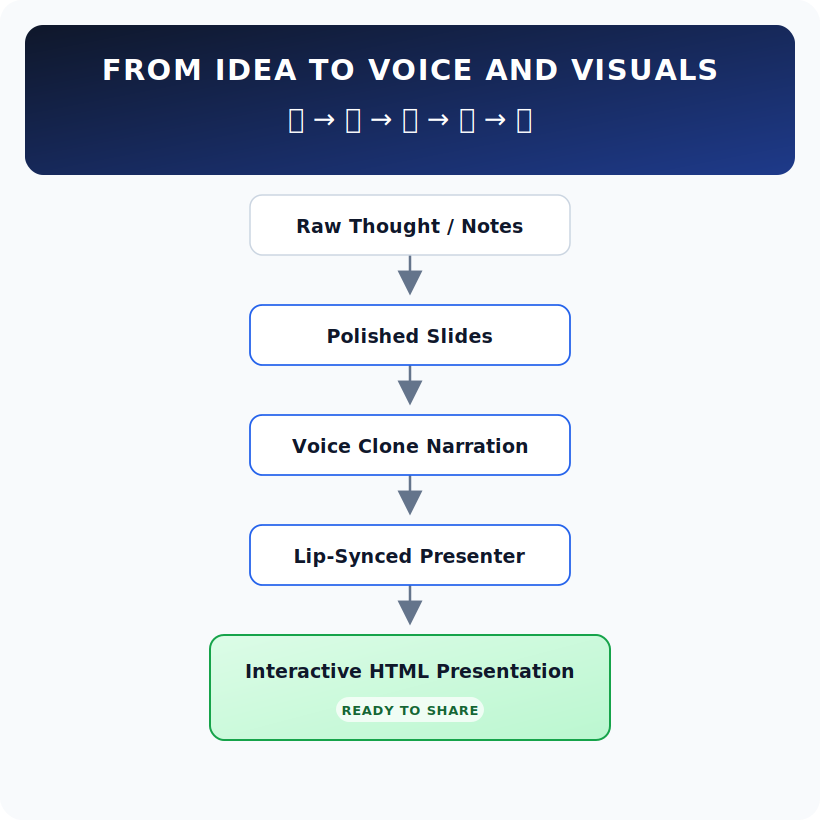

<div align="center">
       
# uruvagam
       
### from idea to voice and visuals  

**கருத்திலிருந்து குரலும் காட்சிகளும்**

<br>



<br>

*Turn raw ideas into narrated, presenter-led, interactive visual experiences.*

</div>

---

I wanted a way to take a topic — or a pile of half-written notes — and turn it into a presentation I could actually narrate, in my own voice, without spending an evening on PowerPoint. So I started stitching together open-source pieces: a local LLM to draft the slides, a TTS model that could clone a 15-second voice sample, and Wav2Lip to make a talking-head video that more-or-less tracks the audio.

This is the result. It is an experiment. It works on my machine (macbook m4 pro max with some decent ram). That is about as much as I can promise.


## What it actually does

You give it notes (or just a topic). It produces, under `outputs/<run>/`:

- a structured deck as `content.json` and `.pptx`
- a per-slide `.wav` narrated in your cloned voice
- a per-slide lip-synced talking-head `.mp4`
- a single self-contained `preview.html` that plays the whole thing in a browser

Every stage is a separate script driven by `make` targets, so you can skip whatever you don't need.

## What it doesn't do (yet)

- There is no UI. Everything runs through `make`.
- The video stage is slow — about 4–5 minutes per slide on an M3 Pro. I have not tried to optimise it.
- TTS sometimes mispronounces acronyms or technical jargon. There is no auto-normaliser. If a slide's `speaker_notes` say `S3://`, you will hear "ess three colon slash slash". Edit the JSON before running `make voice`.
- The quality agent prints a score and a list of issues. It is feedback, not a gate. A "5/10" deck might still be what you wanted.
- It has mostly been tested on Mac Silicon with oMLX. The Ollama and Claude paths exist and the wiring runs, but I have not put real miles on them.

## Three ways to run it

LLM and TTS are independent. Pick whichever combination matches what you already have.

| You have | LLM | TTS |
|---|---|---|
| Mac Silicon with oMLX running | `omlx` | `f5tts` or `qwen3tts-omlx` |
| Anything with Ollama installed | `ollama` | `kokoro` |
| Just an Anthropic API key | `claude` (agents skipped) | `elevenlabs` |

You can mix across rows too — the column just shows the path I happen to have used.

## Quick start

```bash
git clone https://github.com/Iyalvan/uruvagam && cd uruvagam
bash setup.sh                            # creates .venv, prints what your chosen provider needs
export OMLX_API_KEY=...                  # or ANTHROPIC_API_KEY, or start `ollama serve`

make content SOURCE=assets/source_notes.example.txt TITLE="My Deck" DURATION=10
make open
```

Once you have a deck you like:

```bash
make voice                # narrate all slides
make video-poc SLIDE=1    # lip-sync one slide first, so you can decide if the quality is worth the wait
make video-all            # then commit to the long run
make html                 # rebuild preview.html with the new audio + video
```

## You'll need a few of your own files

- A clean 12–18 second WAV of yourself speaking, plus the exact transcript, at `assets/voice_reference.{wav,txt}`. This is what the TTS clones.
- A 1–3 second MP4 of your face, looking at the camera, at `assets/face_reference.mp4`. This drives the talking head.
- Optional but useful: 4–8 sentences at `assets/speaker_style.txt` describing how you naturally talk. The `SpeakerStyleAgent` uses these to rewrite the LLM's generic narration in your voice.
- Optional: a logo image (PNG/JPG) at any path. Pass it via `LOGO=path/to/logo.png` to brand the PPT and HTML footers.

See `.claude/skills/uruvagam/references/assets.md` for the picky details about each format.

## The pipeline, at a glance

`generate.py` → `agents.py` → `slide_gen.py` → `tts.py` → `lipsync_poc.py` → `html_gen.py`

Every script has a `--help`. The Makefile holds the canonical invocations.

## Contributing — please

This is a side project. It exists because I wanted it to exist. It does not exist because I have a roadmap or a release schedule. If you have an idea, a fix, a better TTS engine, a cleaner way to wire the HTML — open an issue, send a PR, fork it and go wild. I would much rather merge your experiment than keep this exactly as it is.

Things I would personally love help with:

- A proper audio normaliser for TTS-hostile text (paths, env vars, acronyms, code-y bits)
- A faster video stage, or a swap to a faster backend that still looks decent
- Better default themes
- Actually exercising the Ollama and Claude paths beyond "the wiring runs"
- Anything else that bugs you when you try to use this

See [CONTRIBUTING.md](CONTRIBUTING.md) for the mechanical bits — how to add a provider, a TTS engine, a video backend.
